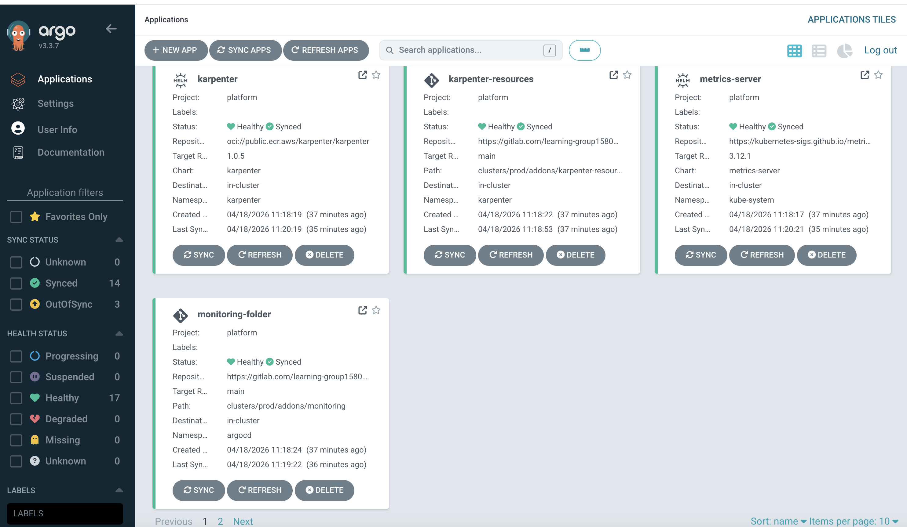
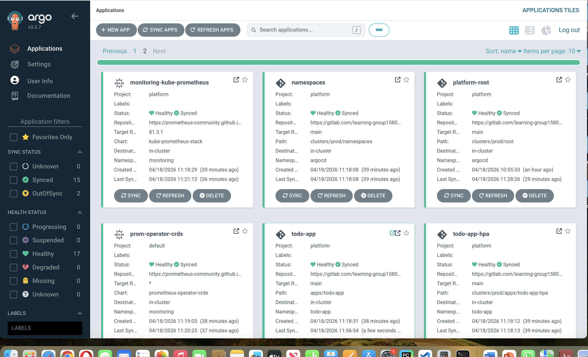
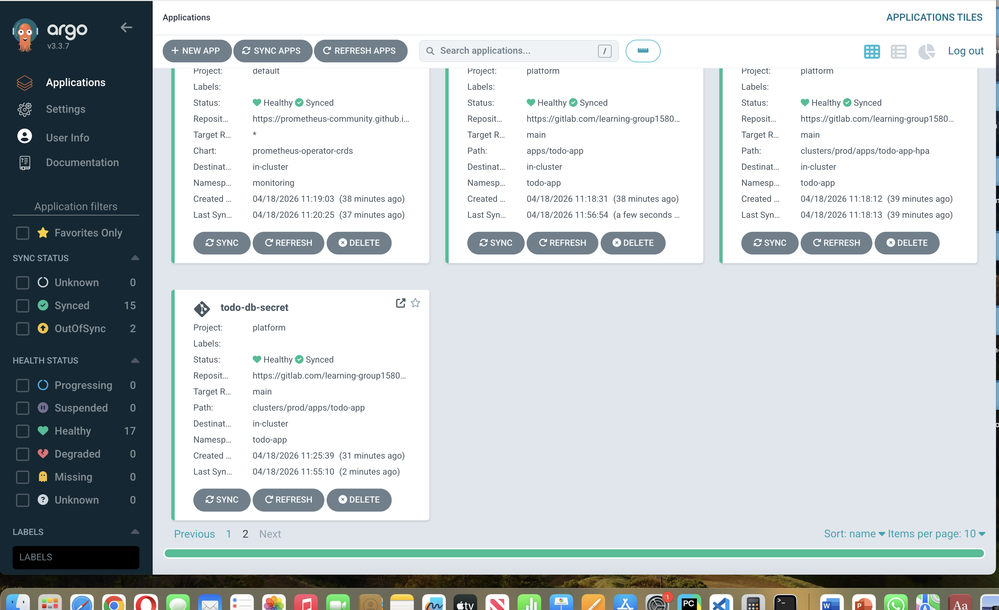

# EKS Platform GitOps

A production-style cloud-native platform built end-to-end on AWS EKS using Terraform, Argo CD GitOps, Karpenter, Prometheus/Grafana observability, and automated CI/CD pipelines.

> The platform was fully deployed and running on AWS. It has been taken offline to avoid ongoing infrastructure costs. All code is here and fully deployable.

---

## What This Project Covers

This is a full platform engineering project — not a tutorial. It includes:

- AWS infrastructure provisioned entirely with **Terraform** (custom modular structure)
- **Argo CD** GitOps with sync-wave ordered deployments across 15 applications
- **Karpenter** for dynamic node provisioning with SQS-based spot interruption handling
- **HPA v2** with CPU and memory autoscaling (fast scale-up, slow scale-down)
- **Prometheus + Grafana** with 4 custom dashboards and ServiceMonitor-based scraping
- **External Secrets Operator** syncing RDS credentials from AWS Secrets Manager
- **Argo CD Image Updater** for automatic image tag updates on ECR push
- **FastAPI + Streamlit** application with health endpoints, Prometheus metrics, and bcrypt auth
- **k6 load tests** ramping to 100 concurrent users with p95 latency thresholds — used to validate DB behaviour under load before adding connection pooling
- **PgBouncer** connection pooling in transaction mode to protect RDS from connection storms
- **GitLab CI pipelines** for Terraform (fmt/validate/plan/apply) and Docker (build/push to ECR)

---

## Repository Structure

```
.
├── infra-repo/          # Terraform — AWS infrastructure (custom modules)
├── platform-repo/       # Argo CD GitOps — all Kubernetes manifests
└── app-repo1/           # Application — FastAPI + Streamlit + Docker + k6 load tests
```

---

## Architecture

```
Users
  │
  ▼
AWS ALB  ←  AWS Load Balancer Controller (Helm, sync-wave 20)
  │
  ▼
EKS Cluster
  │
  ├── Managed Node Group  (bootstrap — system workloads)
  │
  └── Karpenter NodePool  (t2/t3 on-demand, amd64, linux)
        consolidation: WhenEmptyOrUnderutilized after 30s
        CPU limit: 4 cores
        │
        ├── todo-app pods
        │     HPA: min 2, max 10 replicas
        │     Scale on: CPU 60% | Memory 70%
        │     Scale-up window: 30s | Scale-down window: 600s
        │     │
        │     ▼
        │   PgBouncer (transaction mode, port 6432)
        │     connection pooling — protects RDS from storms
        │
        └── Platform controllers
              Karpenter, External Secrets, Argo CD Image Updater,
              Prometheus, Grafana, ALB Controller, Metrics Server
  │
  ▼
Amazon RDS PostgreSQL (private subnet, db.t3.micro)
  └── Credentials injected via External Secrets ← AWS Secrets Manager
```

---

## Infrastructure — infra-repo (Terraform)

All custom modules. No third-party registry modules used.

| Module | What It Provisions |
|---|---|
| `network` | Multi-AZ VPC, public + private subnets, NAT gateway, VPC endpoints |
| `eks-cluster` | EKS control plane, cluster security group, OIDC issuer URL |
| `node-groups` | Managed node group for system/bootstrap workloads |
| `oidc-provider` | OIDC identity provider for IRSA |
| `karpenter` | Controller IRSA role, node IAM role, SQS queue + EventBridge rules for interruption handling |
| `irsa-roles` | Separate IRSA roles for ALB Controller, External Secrets, Argo CD Image Updater, ECR token rotator |
| `rds-postgres` | RDS PostgreSQL in private subnet, security group scoped to EKS node SGs |
| `eks-addons` | Core EKS managed add-ons |

**Remote state:** S3 backend with DynamoDB locking. Separate `backend.hcl` and `terraform.tfvars` per environment (`envs/dev/`, `envs/prod/`).

**GitLab CI pipeline stages:**

```
MR  →  fmt check  →  validate  →  plan:dev + plan:prod (artifacts saved)
main merge  →  apply:prod  (manual trigger)
```

---

## GitOps Platform — platform-repo (Argo CD)

Single root Argo CD application (`root-app.yaml`) manages all child apps using sync-wave annotations for ordered deployment:

| Sync Wave | Application |
|---|---|
| 00 | Namespaces (karpenter, monitoring, external-secrets, todo-app) |
| 05 | External Secrets CRDs |
| 06 | Argo CD Image Updater folder |
| 10 | External Secrets operator + todo-app HPA |
| 15 | Argo CD Image Updater |
| 20 | Metrics Server + AWS Load Balancer Controller |
| 30 | Karpenter (OCI chart from public ECR, v1.0.5) |
| 40 | Karpenter NodePool + EC2NodeClass |
| 45 | Prometheus Operator CRDs |
| 50 | Prometheus + Grafana stack |
| 60 | todo-app (Helm chart + Image Updater) |
| 65 | todo-app DB ExternalSecret |

**Karpenter NodePool:**
```yaml
capacity-type: on-demand
instance-category: t
instance-generation: > 2
instance-size: [micro, small]
consolidationPolicy: WhenEmptyOrUnderutilized
consolidateAfter: 30s
limits:
  cpu: "4"
```

**Argo CD Image Updater:**
- Watches ECR for tags matching `^[0-9a-f]{7,40}$` (git commit SHA)
- Write-back method: commits updated tag to `values-prod.yaml` via HTTPS + Git PAT
- ECR auth: rotating token via CronJob + ExternalSecret

**External Secrets:**
- `ClusterSecretStore` backed by AWS Secrets Manager
- RDS credentials synced into `todo-app-db-secret` (refresh: 1h)
- Git credentials synced for Image Updater authentication

---

## Observability

**kube-prometheus-stack** with all components enabled:

| Component | Status |
|---|---|
| Prometheus | Enabled |
| Grafana | Enabled (sidecar dashboard injection via ConfigMap label) |
| Alertmanager | Enabled |
| kube-state-metrics | Enabled |
| node-exporter | Enabled |

**ServiceMonitor** scrapes `/metrics` on port 8000 every 15s with target labels: `app`, `env`, `team`, `app.kubernetes.io/version`, `app.kubernetes.io/instance`.

**4 custom Grafana dashboards** auto-loaded via ConfigMap sidecar:
- `todo-app-dashboard` — application metrics
- `todo-app-overview-dashboard` — platform overview
- `todo-app-performance-dashboard` — latency and throughput
- `todo-app-k8s-health-dashboard` — Kubernetes resource health

---

## Application — app-repo1 (FastAPI + Streamlit)

**API (FastAPI on port 8000):**

| Endpoint | Method | Description |
|---|---|---|
| `/livez` | GET | Always returns 200 — liveness check |
| `/healthz` | GET | TCP check to DB — returns 503 if unreachable |
| `/api/signup` | POST | Create user with bcrypt password hash |
| `/api/login` | POST | Authenticate, verify bcrypt hash |
| `/api/todos` | GET | List todos for user |
| `/api/todos` | POST | Create todo |
| `/api/todos/{id}` | DELETE | Delete todo |
| `/metrics` | GET | Prometheus metrics endpoint |

**Health server** runs on port 8081 in a background thread. Performs TCP socket check to DB before returning healthy — used for Kubernetes readiness probe.

**Kubernetes probes:**
- Readiness: `GET /` port 8501, initialDelay 15s, period 5s, failureThreshold 3
- Liveness: `GET /` port 8501, initialDelay 30s, period 10s, failureThreshold 3

**GitLab CI pipeline:**
```
push to main
  → docker build (tagged with $CI_COMMIT_SHORT_SHA)
  → docker push to ECR (:<sha> and :latest)
  → Argo CD Image Updater detects new tag
  → commits updated tag to values-prod.yaml
  → Argo CD reconciles → rolling deploy
```

---

## Load Testing (k6)

Located in `app-repo1/load-tests/k6/load-test.js`

**Traffic profile:**

| Stage | Duration | Virtual Users |
|---|---|---|
| Ramp up | 2 min | 0 → 20 |
| Ramp up | 3 min | 20 → 50 |
| Ramp up | 5 min | 50 → 100 |
| Hold | 5 min | 100 |
| Ramp down | 2 min | 100 → 0 |

**Thresholds:** HTTP error rate `< 5%` | p95 latency `< 2000ms`

**Test flow per virtual user:** login → list todos → create todo → list todos → delete todo → sleep 1s

---

## PgBouncer — Database Connection Pooling

### Why PgBouncer Was Added

k6 load testing (ramping to 100 concurrent users) revealed that under sustained load, the application creates a large number of short-lived PostgreSQL connections. Each connection to RDS has a fixed overhead — at scale this causes:

- RDS CPU to spike as it manages hundreds of connections simultaneously
- Connection queue buildup when new pods scale up under HPA
- Risk of hitting RDS `max_connections` limit and rejecting new connections

PgBouncer sits between the application pods and RDS, maintaining a small fixed pool of real database connections and multiplexing many application connections through them.

### Configuration

**Mode:** Transaction pooling — the most efficient mode for short-lived CRUD operations. A real DB connection is only held for the duration of a single transaction, then returned to the pool immediately.

**Deployment:** PgBouncer runs as a dedicated Kubernetes Deployment with a ClusterIP Service inside the `todo-app` namespace. Application pods connect to PgBouncer on port `6432` instead of connecting to RDS directly on port `5432`.

```
todo-app pods  →  PgBouncer :6432 (transaction mode)  →  RDS :5432
                  pool_size: 20 real connections
                  max_client_conn: 200 application connections
```

**Key settings:**

| Setting | Value | Reason |
|---|---|---|
| `pool_mode` | `transaction` | Release connection after each transaction — optimal for CRUD |
| `default_pool_size` | `20` | Max real connections to RDS per database/user pair |
| `max_client_conn` | `200` | Max application connections PgBouncer accepts |
| `server_idle_timeout` | `600` | Close idle server connections after 10 minutes |
| `client_idle_timeout` | `60` | Close idle client connections after 60 seconds |

**Result:** 200 application connections multiplexed into 20 real RDS connections — 10x reduction in connection pressure on the database.

### How It Fits Into the Platform

- PgBouncer credentials are injected from AWS Secrets Manager via External Secrets Operator — no hardcoded passwords
- PgBouncer is deployed via Helm chart in the GitOps platform-repo at sync-wave 55 (after RDS is ready, before the app)
- Prometheus scrapes PgBouncer metrics (active connections, wait queue depth, pool utilization) for Grafana visibility
- If PgBouncer pool is exhausted, the application returns a connection error — this is monitored and alerts fire before it impacts users

### Next Steps After PgBouncer

Once connection pooling is stable under load, the next planned additions are:

- **SQS queue** — decouple long-running operations from the synchronous request path
- **KEDA** — scale pods based on SQS queue depth instead of CPU/memory, enabling true event-driven autoscaling for bursty workloads

---

## Security Controls

| Control | Implementation |
|---|---|
| No static AWS credentials | IRSA via OIDC for every controller |
| Secret injection | AWS Secrets Manager → External Secrets → Kubernetes Secret |
| RDS isolation | Private subnet, SG restricted to EKS node security groups only |
| Password storage | bcrypt hash — never plaintext |
| Least privilege | Separate scoped IAM role per controller |
| Karpenter interruption | SQS queue + EventBridge rules for graceful spot handling |

---

## Screenshots

### Argo CD — All Applications Synced




*Root app managing all child applications with sync-wave ordering. All apps green and healthy.*


### PgBouncer — Connection Pool Metrics

*Active connections, wait queue depth, and pool utilization visible in Grafana.*

> **Note:** Screenshots are from the live deployment before infrastructure was taken offline to control costs.

---

## Running Locally

**Requirements:** Python 3.12, PostgreSQL

```bash
cd app-repo1/web_app_todo
pip install -r requirements.txt

export DB_HOST=localhost
export DB_PORT=5432
export DB_NAME=todo
export DB_USER=postgres
export DB_PASSWORD=postgres

streamlit run web.py --server.port 8501
```

**Docker:**

```bash
docker build -t todo-app:local ./web_app_todo

docker run -p 8501:8501 -p 8000:8000 \
  -e DB_HOST=<host> \
  -e DB_PORT=5432 \
  -e DB_NAME=todo \
  -e DB_USER=<user> \
  -e DB_PASSWORD=<password> \
  todo-app:local
```

---

## Full Tech Stack

| Layer | Technology |
|---|---|
| Cloud | AWS (EKS, RDS, VPC, IAM, Secrets Manager, ECR, S3, SQS, EventBridge) |
| IaC | Terraform (custom modules, S3 + DynamoDB remote state) |
| Orchestration | Kubernetes, Helm |
| Node autoscaling | Karpenter v1.0.5 (EC2NodeClass, NodePool, SQS interruption) |
| Pod autoscaling | HPA v2 (CPU + memory) |
| GitOps | Argo CD, Argo CD Image Updater |
| Observability | Prometheus, Grafana, Alertmanager, kube-state-metrics, node-exporter |
| Security | IRSA, External Secrets Operator, AWS Secrets Manager |
| CI/CD | GitLab CI (Terraform pipeline + Docker build/push pipeline) |
| Application | Python, FastAPI, Streamlit, psycopg2, bcrypt, prometheus_client |
| Connection pooling | PgBouncer (transaction mode) |
| Load testing | k6 |

---

## Notes

- **Live URL:** Taken offline to control costs. Full stack costs approximately $8–12/day when running on AWS
- **CI/CD pipelines:** Originally in GitLab. `.gitlab-ci.yml` files are included in each sub-repo for reference
- **PgBouncer:** Added after k6 load testing revealed connection pressure on RDS at 100 concurrent users. Transaction mode chosen because all operations are short-lived CRUD — session mode would waste connections
- **KEDA:** Planned next step after PgBouncer. Will enable SQS queue depth-based scaling for async workloads — more accurate signal than CPU for bursty traffic patterns
- **Multi-AZ RDS:** Set to `false` to reduce cost. Change `multi_az = true` in `modules/rds-postgres` for production